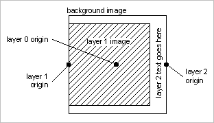

# 例A{#example-a}

静的な背景画像を使用して固定サイズのテンプレートを作成します。可変画像は、左中央の背景に合わせて調整され、背景の幅と高さの80%を超えないように拡大・縮小されます。 最後に、カンバスの右端に縦書きのテキストを配置したテキストレイヤーを1つ作成します。

## テンプレートレコードは {#section-32f54710593e438fa0622224c89380af}

オブジェクトを挿入

<table id="simpletable_97ECA49445634F59B3F1D100412EFC70"> 
 <tr class="strow"> 
  <td class="stentry"> 
  カタログ：:Id  
 </td> 
  <td class="stentry"> 
  myTemplate1  
 </td> 
 </tr> 
 <tr class="strow"> 
  <td class="stentry"> 
  カタログ：：修飾子 
 </td> 
  <td class="stentry"> 
  src=backgroundImage&amp;size=1000,1000&amp;originN=0,0&amp; layer=1&amp;src=$object$&amp;size=800,800&amp;originN=-0.5,0&amp;posN=-0.5,0&amp; layer=2&amp;$text=layer+2+text+goes+here&amp;text=rtf...$text$..rtf-encoding&amp;rotate=-90&amp;originN=0.5,0&amp;pos5=0  
 </td> 
 </tr> 
</table>

すべてのレイヤーの`origin=`値は、レイヤーの配置と整列を厳密に制御するために、テンプレート内で明示的に指定されます。 各レイヤーの原点は、そのレイヤーの目的の整列に一致するように設定されます。 背景（レイヤー0）の`origin=`は中央に設定されています。この値は、実行時に背景画像が変化しないため任意です。レイヤー0の原点の値を使用できます。

`pos=`値は、レイヤーの原点の間に必要なオフセットを提供し、目的のレイヤーの配置を実現します。

レイヤー1画像のアンカーは、左中央に`pos=`の値で配置されます。 この設定は、レイヤー1画像の縦横比に関係なく、背景とレイヤー1画像の間の左中央揃えを実現します。

同様に、テキストレイヤーのアンカーは、自動サイズ調整されたテキストボックスの右中央に`pos=`値で配置されます。 この設定を使用すると、フォントサイズや文字列長に関係なく、回転したテキストの右中央に配置できます。

実際の表示テキストは実行時に提供されるので、変数を使用してテキストをrtf形式エンベロープから分離します。 既定の変数`$object`は、レイヤー1画像に使用されます。 この変数を使用すると、リクエストパスでこの画像を指定できます。

背景画像およびレイヤ 1画像には、任意の画像を使用してもよい。 背景画像にマスクがある場合、マスクされていない領域はデフォルトの背景色（`attribute::BkgColor`）で塗りつぶされるか、`fmt=png-alpha`または`fmt=tif-alpha`の場合は透明のままになります。 背景画像の縦横比が正方形でない場合は、返信画像の中央に配置され、余分なスペースは`attribute::BkgColor`で埋められます。 レイヤー1の画像にアルファデータまたはマスクがある場合、背景画像（または背景色）は透明領域に表示されたままになります。 画像にマスクがない場合、割り当てられた長方形全体が塗りつぶされます。

## テンプレートの使用 {#section-3e04eedc268c482db5a8cfc662c0f327}

` http:// *` サーバー`*/myRootId/anotherImage?template=myTemplate1&$text=about+the+image`

次の画像は、レイヤー1の画像とテキスト文字列の縦横比が異なる場合の合成結果を示しています。

