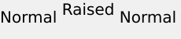

# テキストの配置{#text-positioning}

`text=` レンダラーは、事前サイズ設定されたレイヤーに適用される（つまり size=も指定される）場合、textPs= レンダラーとは基本的に異なるテキストを配置します。

自己サイズ設定 `text=` および `textPs=` レイヤーの外観と位置は似ています。

`textPs=` は、レンダリングされたテキストグリフの一部がテキストボックスの境界の一部より外側に広がっている場合でも、文字セルの上をテキストボックスの上に揃えます（`\vertalt` の場合）。 特定のフォントのレンダリング済みグリフが、テキストボックスの左右の端よりわずかに突き出ている場合もあります。 レンダリングされたテキストをすべてレイヤーの長方形内に含める必要があるアプリケーションの場合は、RTF `\marg*` コマンドまたは `textFlowPath=` を使用して、テキストレンダリング領域を調整できます。

これに対し、`text=` では、レンダリングされたテキストが必要に応じてシフトされ、レンダリングされたすべてのグリフが指定のテキストボックス内に完全に収まることが保証されます。

`text=` は単純なアプリケーションの方がわずかに使いやすいかもしれませんが、`textPs=` はフォントの面やテキストの効果に依存せずに正確な位置を提供します。

## 例 {#section-1b6bdf2ea34447528188ae4e1430ee71}

次に、事前サイズ設定されたテキストの例を示します。 自己サイズ設定のテキストの動作が異なります。

**&#x200B; `Text=` では、常に上部に狭い余白が表示されます。**

`/is/image/?size=230,50&bgc=f0f0f0&fmt=png&text=\fs40Normal%20Normal%20Normal`

**&#x200B; `textPs=` では、テキストがテキストボックスの上部にしっかりと揃えられるので、Arial®:**&#x200B;などの一般的なフォントでも、わずかなクリッピングが発生します。

`/is/image/?size=230,50&bgc=f0f0f0&fmt=png&textPs=\fs40Normal%20Normal%20Normal`

**&#x200B; `text=` は、クリッピングを避けるために、レンダリングされたテキストを自動的に下に移動します。**

`/is/image?size=230,50&bgc=f0f0f0&fmt=png&text=\fs40Normal%20{\up20Raised%20}Normal`

**&#x200B; `textPs=` は文字の盛り上がった部分を含む文字を移動しないため、文字が画層 0:**&#x200B;上にある場合にクリッピングが発生します。

`/is/image?size=230,50&bgc=f0f0f0&fmt=png&textPs=\fs40Normal%20{\up20Raised%20}Normal`

**上部の 10 pt （200 twip）の余白で、このテキストがクリッピングなしでレンダリングされます。**

`/is/image?size=230,50&bgc=f0f0f0&fmt=png&textPs=\margt200\fs40Normal%20{\up20Raised}%20Normal`

**特定のスクリプトフォントのレンダリング済みグリフが、テキストボックスの外側で大幅に拡張される場合があります。**

`/is/image?size=230,50&bgc=f0f0f0&fmt=png&textPs={\fonttbl{\f1\fcharset0%20FluffyFont;}}\f1\fs88%20fluffy%20font%20problems`
