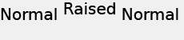

# テキストの配置{#text-positioning}

`text=` レンダラーは、事前サイズのレイヤーに適用する場合（つまり、size=も指定する場合）は、textPs= レンダラーとは根本的に異なるテキストを配置します。

セルフサイズ設定の`text=`および`textPs=`のレイヤーの外観と位置が似ています。

`textPs=`は、レンダリングされたテキスト字形の一部がテキストボックスの境界の一部を超えて伸びている場合でも、文字セルの上部とテキストボックスの上部を整列させます（`\vertalt`と仮定）。 また、特定のフォントのレンダリングされた字形が、テキストボックスの左端と右端からわずかに突出する場合もあります。 レンダリングされたすべてのテキストをレイヤーの長方形に含める必要があるアプリケーションでは、RTF `\marg*` コマンドまたは`textFlowPath=`を使用してテキストのレンダリング領域を調整できます。

対照的に、`text=`はレンダリングされたテキストを必要に応じてシフトし、レンダリングされたすべてのグリフが指定されたテキストボックス内に完全に収まることを保証します。

`text=`は、単純なアプリケーションでは少し使いやすいかもしれませんが、`textPs=`は、フォントの顔やテキスト効果に依存しない正確な配置を提供します。

## 例 {#section-1b6bdf2ea34447528188ae4e1430ee71}

次の例は、事前サイズのテキスト用です。 セルフサイズのテキストの動作が異なります。

**&#x200B; `Text=`は常に上に狭い余白を提供します：**

`/is/image/?size=230,50&bgc=f0f0f0&fmt=png&text=\fs40Normal%20Normal%20Normal`

**&#x200B; `textPs=`は、テキストボックスの上部にテキストを密接に整列させてレンダリングします。これにより、Arial®:**&#x200B;などの一般的なフォントでも、一部がクリッピングされます

`/is/image/?size=230,50&bgc=f0f0f0&fmt=png&textPs=\fs40Normal%20Normal%20Normal`

**&#x200B; `text=`は、クリッピングを避けるために、レンダリングされたテキストを自動的に下に移動します：**

`/is/image?size=230,50&bgc=f0f0f0&fmt=png&text=\fs40Normal%20{\up20Raised%20}Normal`

**&#x200B; `textPs=`は、隆起した部分を含むテキストを移動しないため、テキストがレイヤー0:**&#x200B;にある場合、大幅にクリッピングされます

`/is/image?size=230,50&bgc=f0f0f0&fmt=png&textPs=\fs40Normal%20{\up20Raised%20}Normal`

**上部の10 pt （200 twips）の余白は、このテキストをクリッピングせずにレンダリングします：**

`/is/image?size=230,50&bgc=f0f0f0&fmt=png&textPs=\margt200\fs40Normal%20{\up20Raised}%20Normal`

**特定のスクリプトフォントのレンダリングされた字形が、テキストボックスの外側に大きく広がる場合があります：**

`/is/image?size=230,50&bgc=f0f0f0&fmt=png&textPs={\fonttbl{\f1\fcharset0%20FluffyFont;}}\f1\fs88%20fluffy%20font%20problems`
