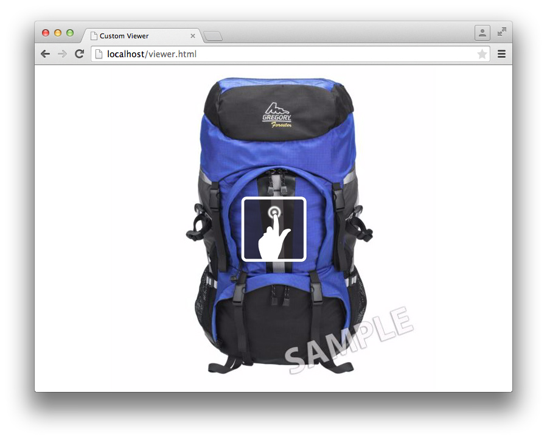
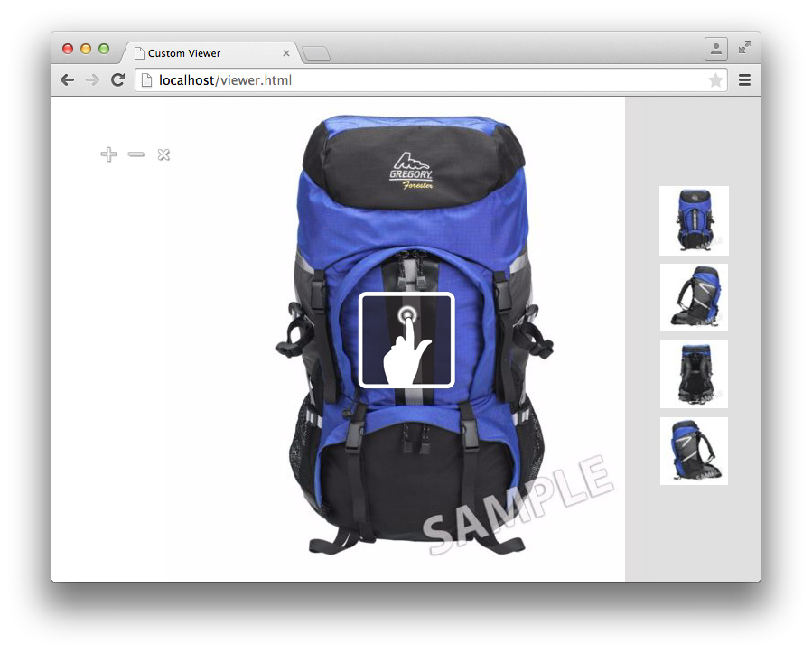

# Viewer SDK チュートリアル{#viewer-sdk-tutorial}

Viewer SDKには、カスタムビューア開発用のJavaScript ベースの一連のコンポーネントが用意されています。 ビューアは、Adobe Dynamic Mediaが提供するリッチメディアコンテンツをweb ページに埋め込むことができるweb ベースのアプリケーションです。

例えば、SDKでは、インタラクティブなズームとパンを提供しています。 また、Dynamic Media Classicというバックエンドアプリケーションを通じてAdobe Dynamic Mediaにアップロードされたアセットの全体像とビデオ再生も提供します。

コンポーネントはHTML5機能に依存していますが、Android™Apple iOSの各デバイス、およびInternet Explorer以降を含むデスクトップで動作するように設計されています。 単一のワークフローをあらゆるサポート対象に提供できます。

SDKは、ビューアコンテンツを構成するUI コンポーネントで構成されます。 これらのコンポーネントは、CSSを使用してスタイルを設定できます。また、セット定義の取得や解析やトラッキングなど、UI以外のコンポーネントをサポートする役割を持つ場合もあります。 すべてのコンポーネントの動作は、修飾子を使用してカスタマイズできます。修飾子を使用すると、例えば、URLの`name=value` ペアとして指定できます。

このチュートリアルでは、基本的なズームビューアの作成に役立つ次のタスクの順序について説明します。

* [Adobe Developer Connectionから最新のViewer SDKをダウンロード ](c-tutorial.md#section-84dc74c9d8e24a2380b6cf8fc28d7127)
* [ ビューア SDKを読み込む](c-tutorial.md#section-98596c276faf4cf79ccf558a9f4432c6)
* [ ビューアーにスタイルを追加する](c-tutorial.md#section-3783125360a1425eae5a5a334867cc32)
* [ コンテナとZoomViewを含む](c-tutorial.md#section-1a01730663154a508b88cc40c6f35539)
* [ ビューアにMediaSet コンポーネントとスウォッチコンポーネントを追加する](c-tutorial.md#section-02b8c21dd842400e83eae2a48ec265b7)
* [ ビューアへのボタンの追加](c-tutorial.md#section-1fc334fa0d2b47eb9cdad461725c07be)
* [スウォッチを垂直方向に設定する](c-tutorial.md#section-91a8829d5b5a4d45a35b7faeb097fcc9)

## Adobe Developer Connectionから最新のViewer SDKをダウンロードする {#section-84dc74c9d8e24a2380b6cf8fc28d7127}

1. Adobe Developer Connection <!-- SDK NO LONGER AVAILABLE TO DOWNLOAD;DOUBLE CHECK WITH AMIT. THIS ENTIRE TOPIC IS LIKELY OBSOLETE. [here](https://marketing.adobe.com/developer/devcenter/scene7/show) -->から最新のViewer SDKをダウンロードします。

   >[!NOTE]
   >
   >SDKはリモートで読み込まれるので、Viewer SDK パッケージをダウンロードする必要なく、このチュートリアルを完了できます。 ただし、Viewer パッケージには、独自のビューアを作成するのに役立つ追加の例とAPI リファレンスガイドが含まれています。

## Viewer SDKの読み込み {#section-98596c276faf4cf79ccf558a9f4432c6}

1. まず、新しいページを設定して、作成する基本的なズームビューアを開発します。

   空のSDK アプリケーションの設定に使用するBootstrapまたはローダーのコードを、この新しいページに追加します。 お気に入りのテキストエディターを開き、次のHTML マークアップを貼り付けます。

   ```html {.line-numbers}
   <!DOCTYPE html> 
   <html> 
       <head> 
           <meta http-equiv="Content-Type" content="text/html; charset=utf-8" /> 
           <meta name="viewport" content="user-scalable=no, height=device-height, width=device-width, initial-scale=1.0, maximum-scale=1.0"/> 
   
           <!-- Hiding the Safari on iPhone OS UI components --> 
           <meta name="apple-mobile-web-app-capable" content="yes"/> 
           <meta name="apple-mobile-web-app-status-bar-style" content="black"/> 
           <meta name="apple-touch-fullscreen" content="no"/> 
   
           <title>Custom Viewer</title> 
   
           <!-- 
               Include Utils.js before you use any of the SDK components. This file  
               contains SDK utilities and global functions that are used to initialize the viewer and load viewer  
               components. The path to the Utils.js determines which version of the SDK that the viewer uses. You  
               can use a relative path if the viewer is deployed on one of the Adobe Dynamic Media servers and it is served  
               from the same domain. Otherwise, specify a full path to one of Adobe Dynamic Media servers that have the SDK  
               installed.  
           --> 
           <script language="javascript" type="text/javascript"      
                   src="http://s7d1.scene7.com/s7sdk/2.8/js/s7sdk/utils/Utils.js"></script> 
   
       </head> 
       <body> 
           <script language="javascript" type="text/javascript"> 
           </script>  
       </body> 
   </html>
   ```

   次のJavaScript コードを`script` タグ内に追加して、`ParameterManager`を初期化します。 これにより、`initViewer`関数内でSDK コンポーネントを作成およびインスタンス化する準備ができます。

   ```javascript {.line-numbers}
   /* We create a self-running anonymous function to encapsulate variable scope. Placing code inside such 
      a function is optional, but this prevents variables from polluting the global object.  */ 
   (function () { 
   
       // Initialize the SDK   
       s7sdk.Util.init(); 
   
       /* Create an instance of the ParameterManager component to collect components' configuration 
          that can come from a viewer preset, URL, or the HTML page itself. The ParameterManager  
          component also sends a notification s7sdk.Event.SDK_READY when all needed files are loaded 
          and the configuration parameters are processed. The other components should never be initialized 
          outside this handler. After defining the handler for the s7sdk.Event.SDK_READY event, it 
          is safe to initiate configuration initialization by calling ParameterManager.init(). */ 
       var params = new s7sdk.ParameterManager(); 
   
       /* Event handler for s7sdk.Event.SDK_READY dispatched by ParameterManager to initialize various components of  
          this viewer. */ 
       function initViewer() { 
   
       }  
   
       /* Add event handler for the s7sdk.Event.SDK_READY event dispatched by the ParameterManager when all modifiers 
          are processed and it is safe to initialize the viewer. */ 
       params.addEventListener(s7sdk.Event.SDK_READY, initViewer, false); 
   
       /* Initiate configuration initialization of ParameterManager. */ 
       params.init(); 
   
   }());
   ```

1. ファイルを空のテンプレートとして保存します。 任意のファイル名を使用できます。

   この空のテンプレートファイルは、今後ビューアを作成する際に参照として使用できます。 このテンプレートは、ローカルで動作し、web サーバーから提供される場合に機能します。

次に、ビューアーにスタイルを追加します。

## ビューアへのスタイルの追加 {#section-3783125360a1425eae5a5a334867cc32}

1. 作成しているこのページ全体ビューアでは、いくつかの基本スタイルを追加できます。

   次の`style` ブロックを`head`の下部に追加します。

   ```html {.line-numbers}
   <style> 
       html, body { 
           width: 100%; 
           height: 100%; 
       } 
       body { 
           /* Remove any padding and margin around the edges of the browser window */ 
           padding: 0; 
           margin: 0; 
   
           /* We set overflow to hidden so that scroll bars do not flicker when resizing the window */ 
           overflow: hidden; 
       } 
   </style>
   ```

コンポーネント `Container`と`ZoomView`を追加します。

## ContainerとZoomViewを含む {#section-1a01730663154a508b88cc40c6f35539}

1. コンポーネント `Container`と`ZoomView`を含めて、実際のビューアを作成します。

   次の`include` ステートメントを、[!DNL Utils.js] スクリプトの読み込み後、`<head>`要素の下部に挿入します。

   ```javascript {.line-numbers}
   <!-- 
       Add an "include" statement with a related module for each component that is needed for that particular  
       viewer. Check API documentation to see a complete list of components and their modules. 
   --> 
   <script language="javascript" type="text/javascript"> 
       s7sdk.Util.lib.include('s7sdk.common.Container');  
       s7sdk.Util.lib.include('s7sdk.image.ZoomView');  
   </script>
   ```

1. 次に、様々なSDK コンポーネントを参照する変数を作成します。

   次の変数をメインの匿名関数の先頭（`s7sdk.Util.init()`のすぐ上）に追加します。

   ```javascript {.line-numbers}
   var container, zoomView;
   ```

1. `initViewer`関数内に次の関数を挿入して、修飾子を定義し、それぞれのコンポーネントをインスタンス化できます。

   ```javascript {.line-numbers}
   /* Modifiers can be added directly to ParameterManager instance */ 
   params.push("serverurl", "http://s7d1.scene7.com/is/image"); 
   params.push("asset", "Scene7SharedAssets/ImageSet-Views-Sample"); 
   
   /* Create a viewer container as a parent component for other user interface components that  
      are part of the viewer application and associate event handlers for resize and  
      full-screen notification. The advantage of using Container as the parent is the  
      component's ability to resize and bring itself and its children to full-screen. */ 
   container = new s7sdk.common.Container(null, params, "s7container"); 
   container.addEventListener(s7sdk.event.ResizeEvent.COMPONENT_RESIZE, containerResize, false); 
   
   /* Create ZoomView component */ 
   zoomView = new s7sdk.image.ZoomView("s7container", params, "myZoomView");  
   
   /* We call this to ensure all SDK components are scaled to initial conditions when viewer loads */ 
   resizeViewer(container.getWidth(), container.getHeight());
   ```

1. 上記のコードを適切に実行するには、`containerResize` イベントハンドラーとヘルパー関数を追加します。

   ```javascript {.line-numbers}
   /* Event handler for s7sdk.event.ResizeEvent.COMPONENT_RESIZE events dispatched by Container to resize 
      various view components included in this viewer. */ 
   function containerResize(event) { 
       resizeViewer(event.s7event.w, event.s7event.h); 
   } 
   
   /* Resize viewer components */ 
   function resizeViewer(width, height) { 
       zoomView.resize(width, height); 
   }
   ```

1. ページをプレビューして、作成したページを確認できます。 例えば、次のようなページを作成しましょう。

   

次に、コンポーネント `MediaSet`と`Swatches`をビューアーに追加します。

## ビューアへのMediaSet コンポーネントとスウォッチコンポーネントの追加 {#section-02b8c21dd842400e83eae2a48ec265b7}

1. ユーザーがセットから画像を選択できるようにするには、コンポーネント `MediaSet`と`Swatches`を追加します。

   次のSDKを追加します。

   ```javascript {.line-numbers}
   s7sdk.Util.lib.include('s7sdk.set.MediaSet'); 
   s7sdk.Util.lib.include('s7sdk.set.Swatches');
   ```

1. 変数リストを次のように更新します。

   ```javascript {.line-numbers}
   var mediaSet, container, zoomView, swatches;
   ```

1. `initViewer`関数内の`MediaSet`および`Swatches` コンポーネントをインスタンス化します。

   `ZoomView`および`Container` コンポーネントの後に`Swatches` インスタンスを必ずインスタンス化してください。それ以外の場合、重ね順で`Swatches`が非表示になります。

   ```javascript {.line-numbers}
   // Create MediaSet to manage assets and add event listener to the NOTF_SET_PARSED event 
   mediaSet = new s7sdk.set.MediaSet(null, params, "mediaSet"); 
   
   // Add MediaSet event listener 
   mediaSet.addEventListener(s7sdk.event.AssetEvent.NOTF_SET_PARSED, onSetParsed, false); 
   
   /* create Swatches component and associate event handler for swatch selection notification */ 
   swatches = new s7sdk.set.Swatches("s7container", params, "mySwatches");   
   swatches.addEventListener(s7sdk.event.AssetEvent.SWATCH_SELECTED_EVENT, swatchSelected, false);
   ```

1. 次のイベントハンドラー関数を追加します。

   ```javascript {.line-numbers}
   /* Event handler for the s7sdk.event.AssetEvent.NOTF_SET_PARSED event dispatched by MediaSet to 
      assign the asset to the Swatches when parsing is complete. */ 
   function onSetParsed(e) { 
   
       // set media set for Swatches to display  
       var mediasetDesc = e.s7event.asset;  
       swatches.setMediaSet(mediasetDesc); 
   
       // select the first swatch by default  
       swatches.selectSwatch(0, true);      
   } 
   
   /* Event handler for s7sdk.event.AssetEvent.SWATCH_SELECTED_EVENT events dispatched by Swatches to switch 
      the image in the ZoomView when a different swatch is selected. */ 
   function swatchSelected(event) {     
       zoomView.setItem(event.s7event.asset);  
   }
   ```

1. 次のCSSを`style`要素に追加して、ビューアの下部にスウォッチを配置します。

   ```CSS {.line-numbers}
   /* Align swatches to bottom of viewer */ 
   .s7swatches { 
       bottom: 0; 
       left: 0; 
       right: 0; 
       height: 150px; 
   }
   ```

1. ビューアーをプレビューします。

   スウォッチがビューアの左下にあることに注意してください。 スウォッチを使用してビューア全体の幅を指定するには、ユーザーがブラウザーのサイズを変更するたびに、スウォッチのサイズを手動で変更する呼び出しを追加します。 `resizeViewer`関数に次を追加します。

   ```javascript {.line-numbers}
   swatches.resize(width, swatches.getHeight());
   ```

   これで、ビューアは次の画像のようになります。 ビューアのブラウザーウィンドウのサイズを変更して、結果として生じる動作を確認します。

   

次に、ビューアにズームイン、ズームアウト、ズームリセットボタンを追加します。

## ビューアへのボタンの追加 {#section-1fc334fa0d2b47eb9cdad461725c07be}

1. 現在、ユーザーはクリックジェスチャーまたはタッチジェスチャーのみを使用してズームできます。 そのため、ビューアに基本的なズーム制御ボタンを追加します。

   次のボタンコンポーネントを追加します。

   ```CSS {.line-numbers}
   s7sdk.Util.lib.include('s7sdk.common.Button');
   ```

1. 変数リストを次のように更新します。

   ```javascript {.line-numbers}
   var mediaSet, container, zoomView, swatches, zoomInButton, zoomOutButton, zoomResetButton;
   ```

1. `initViewer`関数の下部にボタンをインスタンス化します。

   CSSで`z-index`を指定しない限り、順序は重要であることに注意してください。

   ```CSS {.line-numbers}
   /* Create Zoom In, Zoom Out and Zoom Reset buttons */ 
   zoomInButton  = new s7sdk.common.ZoomInButton("s7container", params, "zoomInBtn"); 
   zoomOutButton = new s7sdk.common.ZoomOutButton("s7container", params, "zoomOutBtn"); 
   zoomResetButton = new s7sdk.common.ZoomResetButton("s7container", params, "zoomResetBtn"); 
   
   /* Add handlers for zoom in, zoom out and zoom reset buttons inline. */ 
   zoomInButton.addEventListener("click", function() { zoomView.zoomIn(); }); 
   zoomOutButton.addEventListener("click", function() { zoomView.zoomOut(); }); 
   zoomResetButton.addEventListener("click", function() { zoomView.zoomReset(); });
   ```

1. 次に、ファイルの上部にある`style` ブロックに以下を追加して、ボタンの基本的なスタイルを定義します。

   ```CSS {.line-numbers}
   /* define styles common to all button components and their sub-classes */ 
   .s7button { 
       position:absolute; 
       width: 28px; 
       height: 28px; 
       z-index:100; 
   } 
   
   /* position individual buttons*/ 
   .s7zoominbutton  { 
       top: 50px; 
       left: 50px; 
    } 
   .s7zoomoutbutton  { 
       top: 50px; 
       left: 80px; 
    } 
   .s7zoomresetbutton  { 
       top: 50px; 
       left: 110px; 
    }
   ```

1. ビューアーをプレビューします。 例えば、次のようになります。

   

   次に、スウォッチを垂直方向に右上に配置するように設定します。

## スウォッチを垂直方向に設定する {#section-91a8829d5b5a4d45a35b7faeb097fcc9}

1. 修飾子は、`ParameterManager` インスタンスで直接設定できます。

   `Swatches`の親指レイアウトを1行として設定できるように、`initViewer`関数の先頭に次の行を追加します。

   ```javascript {.line-numbers}
   params.push("Swatches.tmblayout", "1,0");
   ```

1. `resizeViewer`内の次のサイズ変更呼び出しを更新します。

   ```javascript {.line-numbers}
   swatches.resize(swatches.getWidth(), height);
   ```

1. `ZoomViewer.css`で次の`s7swatches` ルールを編集します。

   ```CSS {.line-numbers}
   .s7swatches { 
       top:0 ; 
       bottom: 0; 
       right: 0; 
       width: 150px; 
   }
   ```

1. ビューアーをプレビューします。 例えば、次のようになります。

   

   これで、基本的なズームビューアが完成しました。

   このビューアチュートリアルでは、Dynamic Media ビューア SDKの基本事項について説明します。 SDKを使用すると、様々な標準コンポーネントを使用して、ターゲットオーディエンス向けのリッチな視聴エクスペリエンスを簡単に構築およびスタイル設定できます。
